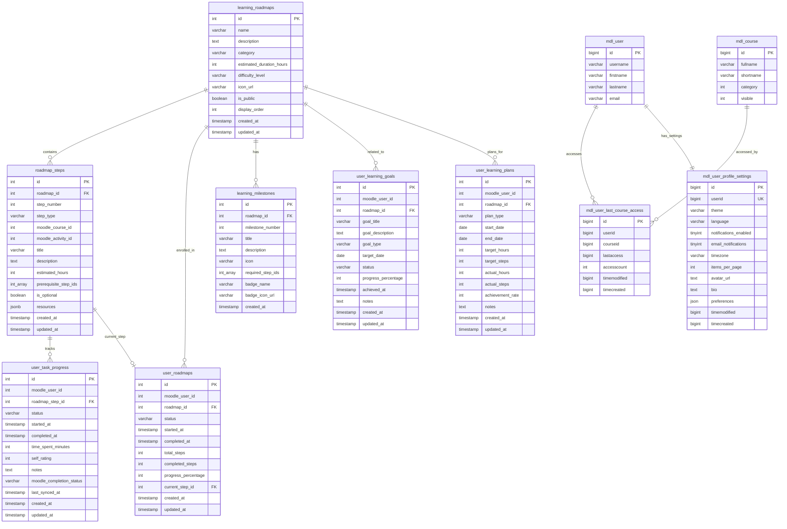
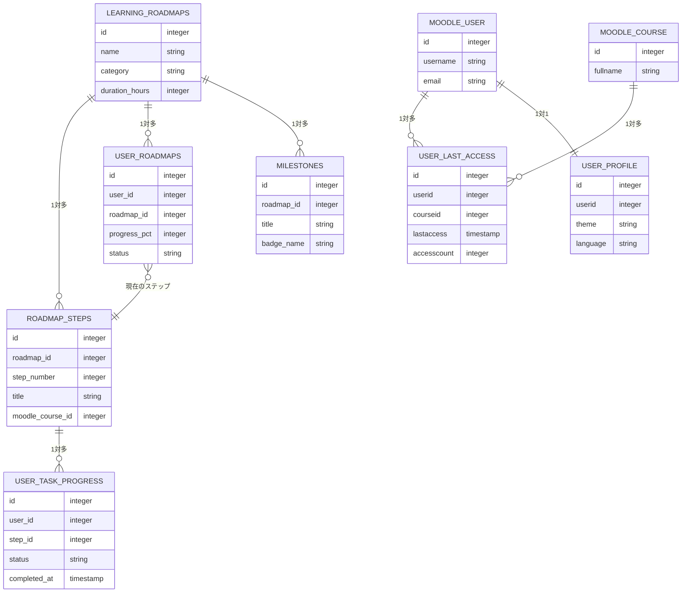
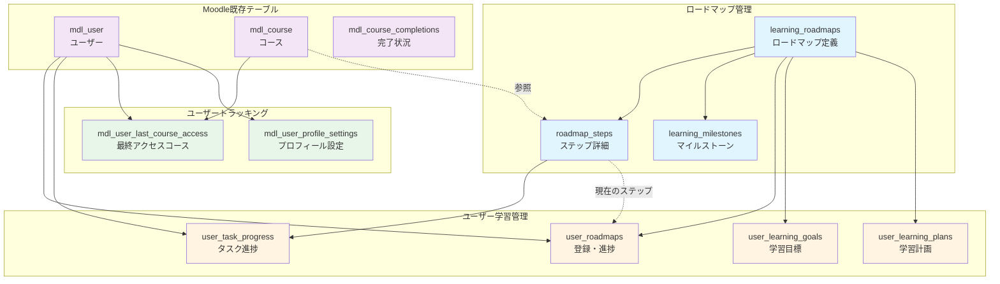
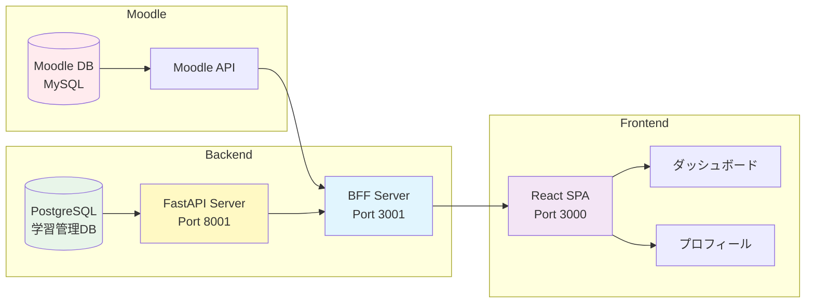
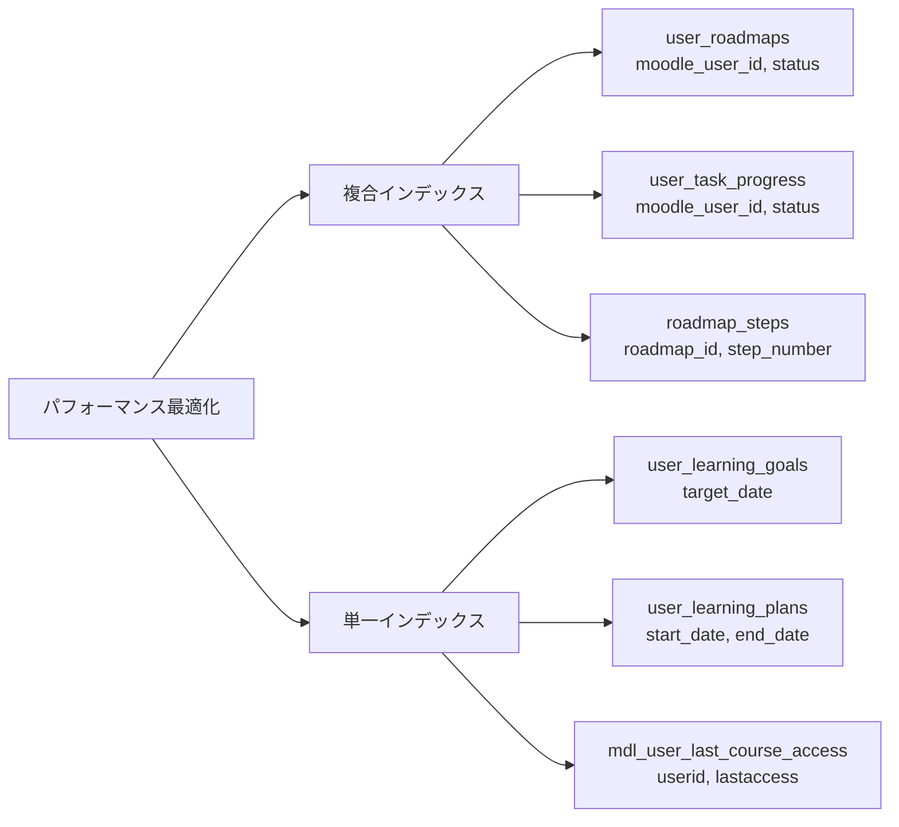

# データベース ER図

## 学習ダッシュボードシステム全体のER図



## 簡略版ER図（主要な関係のみ）



## テーブル分類図



## データフロー図



## キーとなる関係性の説明

### 1. ロードマップの階層構造

```
learning_roadmaps (ロードマップ)
    ↓ 1対多
roadmap_steps (ステップ)
    ↓ 1対多
user_task_progress (ユーザー進捗)
```

### 2. ユーザーの学習状態

```
user_roadmaps (ユーザーのロードマップ登録)
    ├─ progress_percentage (全体の進捗率)
    ├─ current_step_id → roadmap_steps (現在のステップ)
    └─ completed_steps / total_steps (完了数/総数)
```

### 3. マイルストーン達成判定

```
learning_milestones (マイルストーン定義)
    ├─ required_step_ids[] (必要なステップID配列)
    └─ user_task_progress (ユーザー進捗) で達成判定
```

### 4. ユーザートラッキング

```
mdl_user (Moodleユーザー)
    ├─ 1対多 → mdl_user_last_course_access (アクセス履歴)
    └─ 1対1 → mdl_user_profile_settings (プロフィール設定)
```

## インデックス戦略

### 高速検索が必要なカラム



## まとめ

このER図は以下の機能を実現します：

1. **ロードマップ管理** - 学習経路の定義と管理
2. **進捗追跡** - ユーザーごとの詳細な進捗管理
3. **目標管理** - 学習目標と計画の設定・追跡
4. **マイルストーン** - 達成感を得られるゲーミフィケーション
5. **ユーザートラッキング** - アクセス履歴とプロフィール管理

すべてのテーブルが適切に正規化され、パフォーマンスを考慮したインデックスが設定されています。
